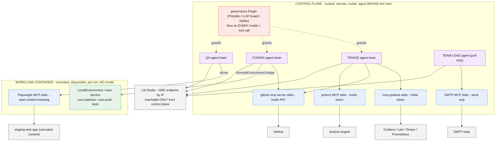
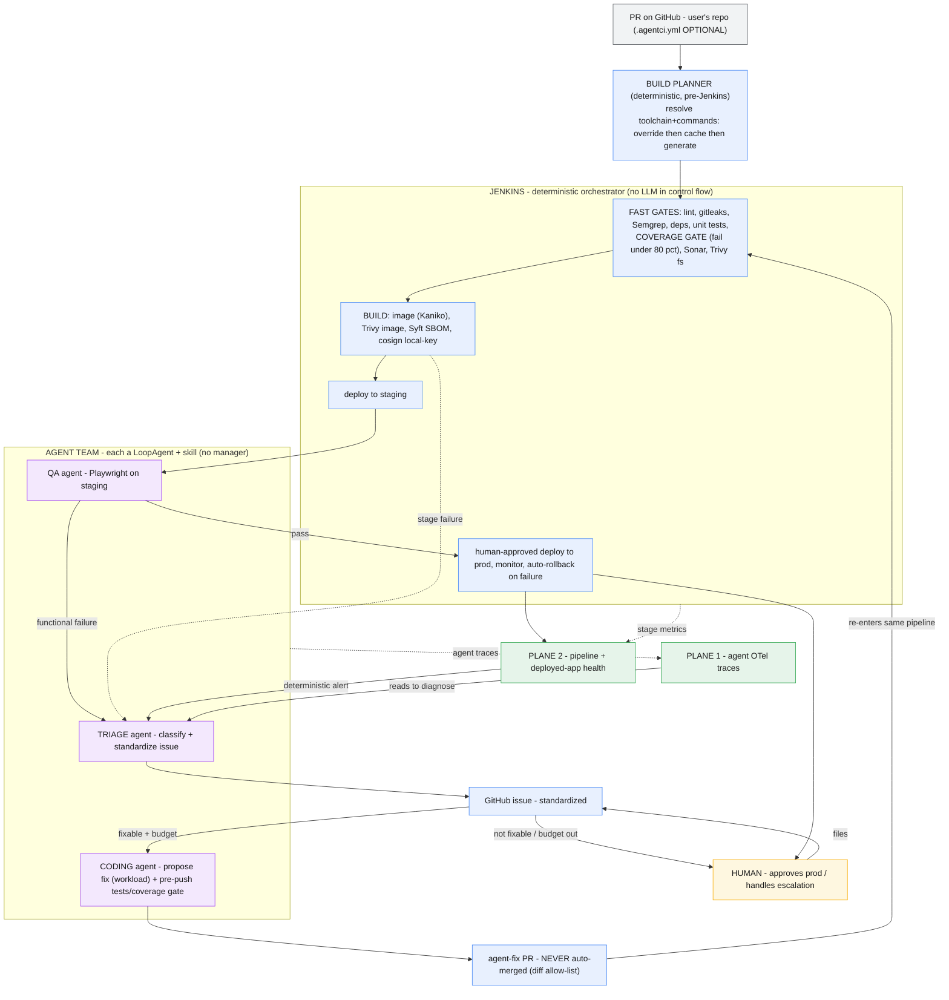
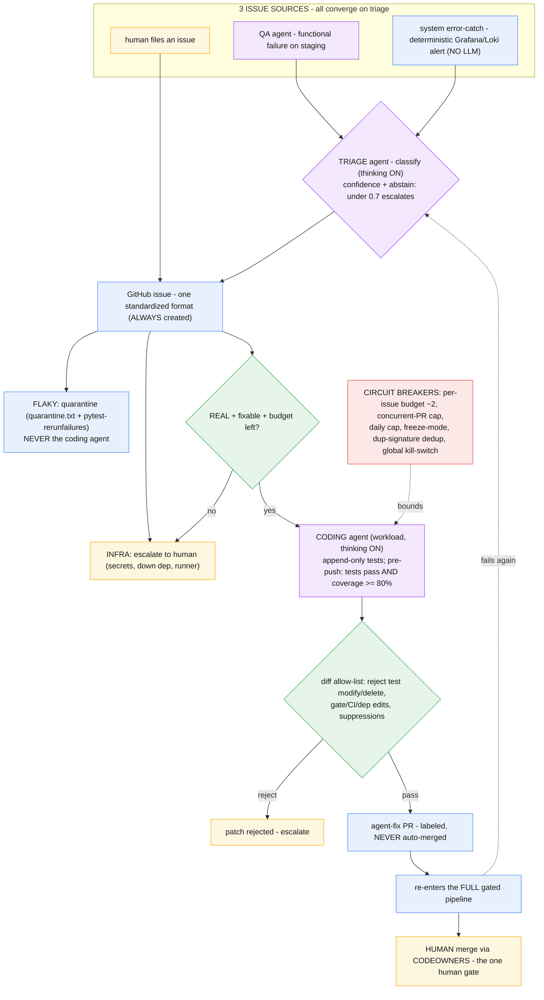
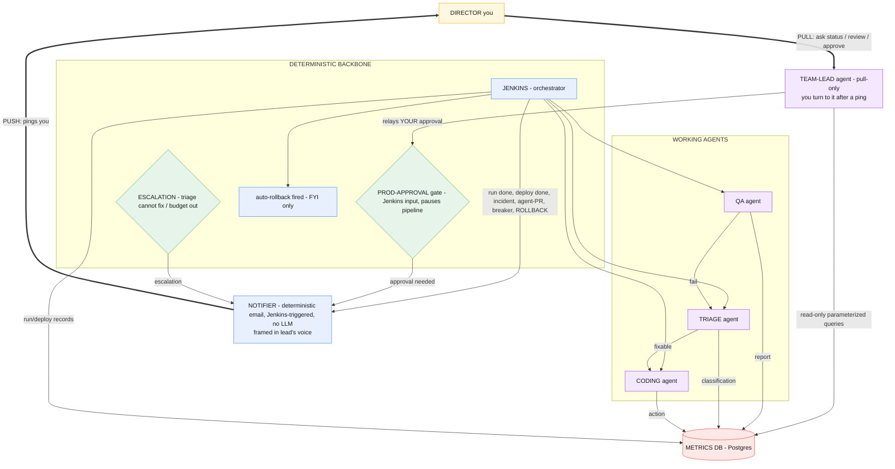
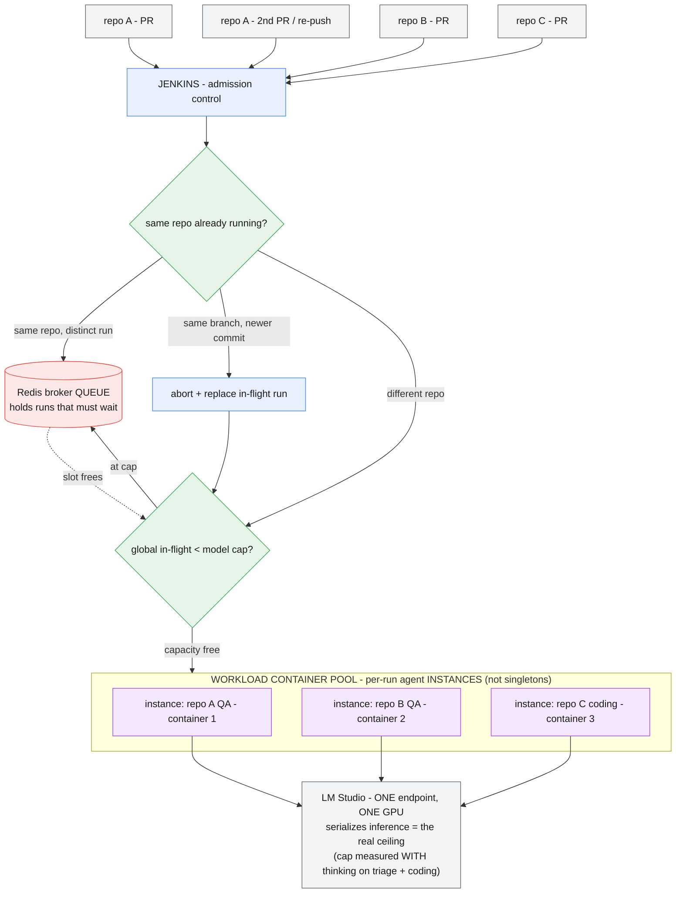
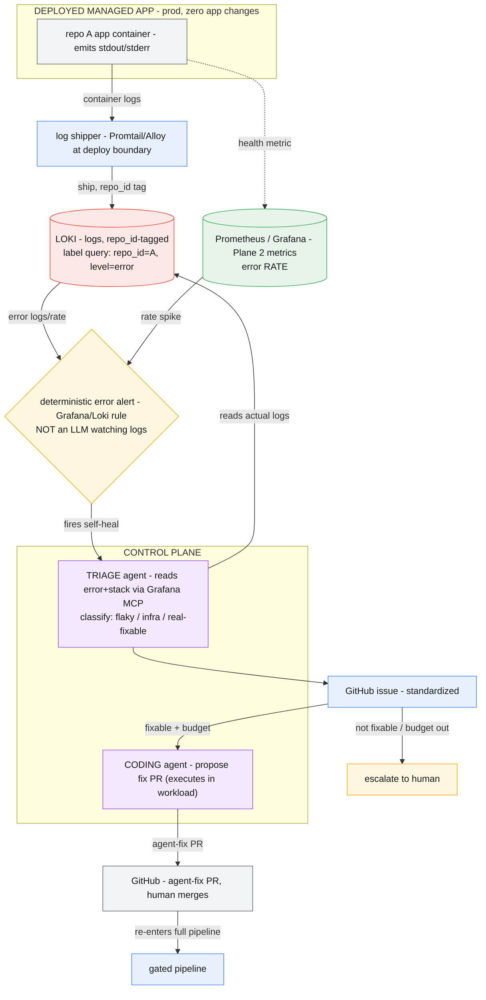
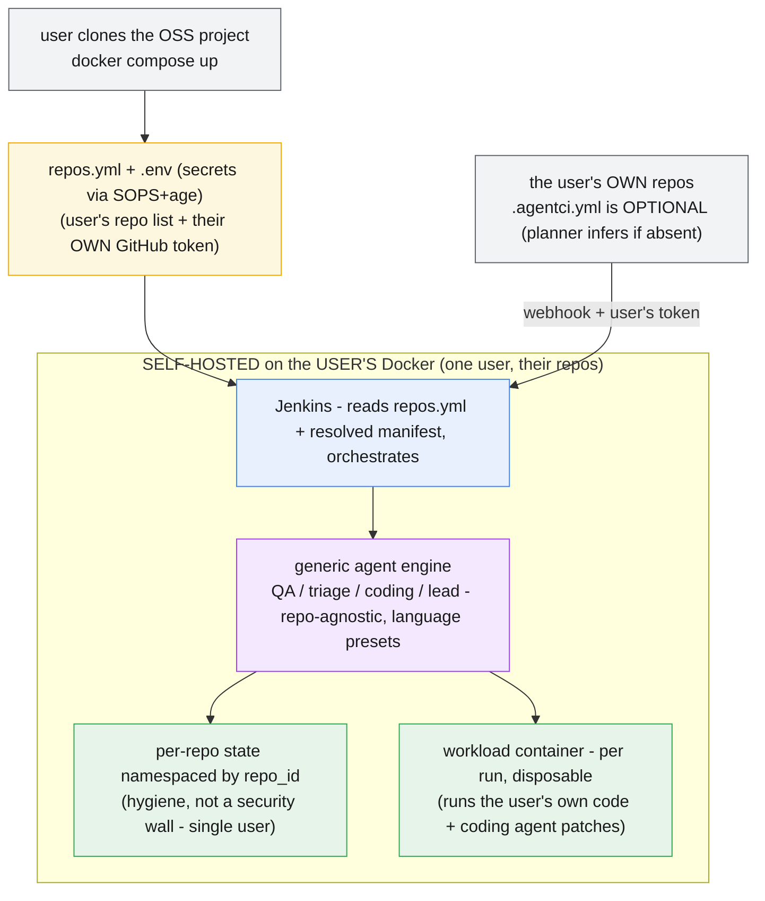

# Architecture Diagrams — Self-Healing CI/CD Agent Team

Companion to `adk_agent_build_plan.md`, `HANDOFF.md`, and `CLAUDE.md`. These render in
GitHub, VS Code (Mermaid preview), and most Markdown viewers. Each diagram answers **one**
question — there is deliberately no single master diagram.

All diagrams reflect the architecture **as settled through the latest planning pass** (append-only
tests, the ≥80% coverage gate, HITL-in-Jenkins, the per-agent thinking policy, LoopAgent =
ADK Template-workflow). If a diagram and the prose ever disagree, the prose docs win — open an issue.

**Color legend (shared across all diagrams):**
- 🟪 **agent** (purple) — an LLM agent (a `LoopAgent` + a skill)
- 🟦 **pipeline / MCP** (blue) — deterministic pipeline step, or an MCP server (no LLM judgment)
- 🟩 **gate / scale** (green) — a decision gate or a scale/runtime component
- 🟥 **data / governance** (red) — a datastore, or a governance/secrets control
- 🟨 **human** (yellow) — you, the director
- ⬜ **external** (grey) — an external system (GitHub, LM Studio, the deployed app)

---

## 1. Trust boundary + MCP placement (the foundational topology)

**Answers:** what runs where, and why "uniform wiring ≠ uniform privilege."
**Reflects:** Architecture decision (two-container topology); Phase 1/1.5; HANDOFF §1.5-B.

The key invariant this encodes: **each agent's *brain* and model calls run in the control plane;
only its *untrusted execution* (running patches, driving a browser) runs in the disposable workload
container. The model never enters the workload** — the control plane bridges in via
`RemoteEnvironment` → `LocalEnvironment`. Credentialed MCP servers (GitHub/Jenkins/Grafana/SMTP)
sit in the control plane with the secrets; only open-ended, untrusted-inbound Playwright sits in the
workload.

---

## 2. CI/CD pipeline (the product's deterministic skeleton)

**Answers:** how a PR flows from open → gates → staging → human-approved prod, with agents as steps.
**Reflects:** Phase 9 (pipeline order, build planner, two observability planes); invariants #7, #9.

Jenkins orchestrates; **agents are steps, never the orchestrator**. A deterministic **build planner**
resolves the toolchain/commands *before* Jenkins. The coverage gate (`--cov-fail-under=80`) sits
right after unit tests, and Sonar runs *after* tests so it can consume the coverage report.

---

## 3. Self-heal loop (hardened) — the safety-critical path

**Answers:** how a failure becomes a fix safely, and every reward-hacking / runaway guard on the way.
**Reflects:** Phase 9 self-heal; invariants #8, #9; the append-only-tests + coverage-gate decisions.

This is where most of the hardening lives. Three issue sources converge on triage; triage **always
creates a standardized issue**; the branch is deterministic (flaky → quarantine, *never* the coding
agent; infra → escalate; real+fixable+budget → coding agent). The coding agent is bounded by
**append-only tests + a pre-push ≥80% coverage gate**, its diff passes the **allow-list**, the PR is
**never auto-merged**, it **re-enters the full pipeline**, and **circuit breakers** bound the whole loop.

---

## 4. Communication model — how you and the system reach each other

**Answers:** when you get pinged vs. when you go ask, and the exactly-two things you must approve.
**Reflects:** Phase 9 communication model; the HITL-placement decision (gates in Jenkins, not `RequestInput`).

**Push** is a deterministic notifier (Jenkins-triggered, no LLM, framed in the lead's voice) — it
can't forget to fire. **Pull** is the team-lead agent — it converses and relays, but can't self-trigger.
Separate components = the safety. The **prod-approval gate is a Jenkins `input` step** (resource-cheap
pause), *not* an ADK `RequestInput` (which would hold a model slot + container open — see HANDOFF traps).

---

## 5. Concurrency model — per-run instances and the real ceiling

**Answers:** how many runs go in parallel, and why adding containers doesn't raise throughput.
**Reflects:** Phase 7 concurrency model; invariant #14; the thinking-policy cap-sizing tie-in.

An agent is a **definition instantiated per run** in its own disposable container — not a long-lived
singleton. Two-layer admission: per-repo serialization (correctness) + a global in-flight cap
(LLM backpressure). The cap is sized to **measured model capacity, not container count** — the single
LM Studio endpoint serializes inference, so it *is* the ceiling. Raise it by scaling the model
(vLLM / 2nd instance), not by adding containers.

---

## 6. Managed-app error capture — where a deployed app's crash gets caught

**Answers:** how a runtime failure in a *deployed user app* (not the pipeline) triggers self-heal.
**Reflects:** Phase 9 managed-app log capture; closes "where does a repo crash get caught."

The deploy harness ships the deployed app's stdout/stderr to **Loki, tagged by `repo_id`, with zero
app changes** (clone-and-go). A **deterministic** Grafana/Loki alert (not an LLM watching logs) is the
"system error-catch" trigger; triage then reads the actual error + stack via the Grafana MCP.

---

## 7. OSS clone-and-go — what a stranger actually does (Phase 10)

**Answers:** how the product packages so a new user runs it on their own repos with near-zero config.
**Reflects:** Phase 10 packaging; the generic-engine / `repos.yml`-only / `repo_id`-namespacing goals.

`repos.yml` is the **only** file the user must write; `.agentci.yml` is an optional override the build
planner infers when absent. The engine is repo-agnostic; everything repo-specific is config.

---

### Diagram-to-doc cross-reference

| # | Diagram | Primary doc section |
|---|---|---|
| 1 | Trust boundary + MCP placement | Architecture decisions; Phase 1/1.5; HANDOFF §1.5-B |
| 2 | CI/CD pipeline | Phase 9 (pipeline order, build planner) |
| 3 | Self-heal loop (hardened) | Phase 9 (self-heal); invariants #8, #9 |
| 4 | Communication model | Phase 9 (communication); HITL-placement note |
| 5 | Concurrency model | Phase 7; invariant #14 |
| 6 | Managed-app error capture | Phase 9 (managed-app log capture) |
| 7 | OSS clone-and-go | Phase 10 (packaging) |
